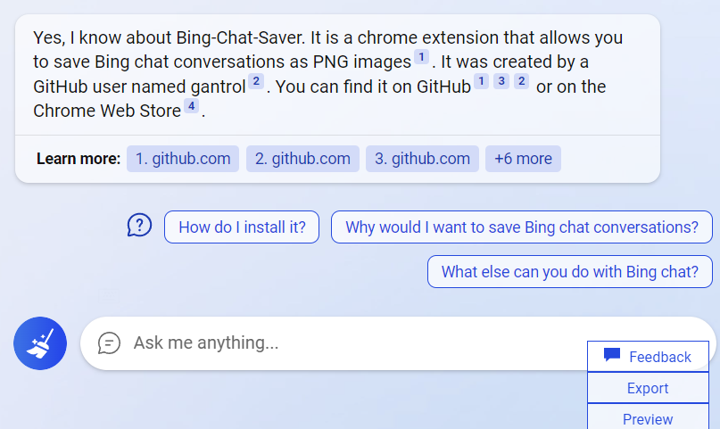
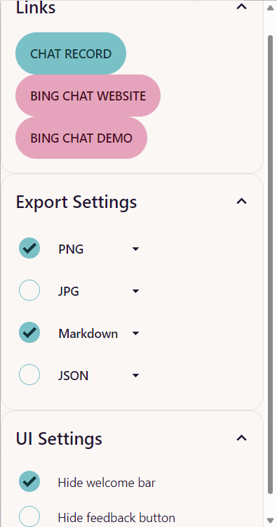

# Bing Chat Saver

[](README.zh_CN.md)
[](https://chrome.google.com/webstore/detail/bing-chat-saver/ficbllnhlgldegblbimkeldcdhfjppkg)
[](https://microsoftedge.microsoft.com/addons/detail/nkmgdpbijnpjfgpokgkomodmpmkencca)

## Feature

This extension can export the chat history of bing search, and save it in browser's indexedDB for reviewing. 

It helps you use Bing Chat at Chrome.

Export formats:

- PNG
- JPG
- JSON
- Markdown

And it can hide the welcome message or the feedback button.

### Note

Bing Chat has history feature now.


## Usage

### New Buttons

> Demo question: Do you know the Bing-Chat-Saver, a chrome extension that saves bing chat?

Click Buttons below feedback button at right bottom of the chat UI.



- Click `Preview` button, it will show the chat history as PNG file in a new tab;
- Click `Export` button, it will download the chat history as PNG file by default, and you can choose other format in popup page.

### Options in Popup Page

More Exporting Options is in Popup Page:



### Review

Click the `CHAT RECORD` button on top of Links in the Popup. You can see:


### Demo results


## Download

- [Chrome Store](https://chrome.google.com/webstore/detail/bing-chat-saver/ficbllnhlgldegblbimkeldcdhfjppkg?hl=en) for stable version. (one or two days later than stable release)
- [Edge Addon]((https://microsoftedge.microsoft.com/addons/detail/nkmgdpbijnpjfgpokgkomodmpmkencca)) (one week later than stable release)
- Go to release for latest version, download `.zip` and load unpacked at `edge://extensions/` . As the bing saying, you can reference [this acticle](https://dev.to/ben/how-to-install-chrome-extensions-manually-from-github-1612#:~:text=How%20to%20install%20Chrome%20extensions%20manually%20from%20GitHub,navivigate%20to%20the%20folder%20you%20downloaded%20from%20GitHub)

## TODO

1. redisign: auto saving feature for performance and reliability

Others: [bing-search-saver broad](https://github.com/users/gantrol/projects/5)

## Dev

> Plasmo default document below, other develop infomation at [manual](./docs/manual.md)

This is a [Plasmo extension](https://docs.plasmo.com/) project bootstrapped with [`plasmo init`](https://www.npmjs.com/package/plasmo).

### Getting Started

First, make sure to replace `type="ts"` with `lang="ts"` in your Svelte components.

Second, run the development server:

```bash
pnpm dev
# or
npm run dev
```

Open your browser and load the appropriate development build. For example, if you are developing for the chrome browser, using manifest v3, use: `build/chrome-mv3-dev`.

You can start editing the popup by modifying `popup.tsx`. It should auto-update as you make changes. To add an options page, simply add a `options.tsx` file to the root of the project, with a react component default exported. Likewise to add a content page, add a `content.ts` file to the root of the project, importing some module and do some logic, then reload the extension on your browser.

For further guidance, [visit our Documentation](https://docs.plasmo.com/)

### Making production build

Run the following:

```bash
pnpm build
# or
npm run build
```

This should create a production bundle for your extension, ready to be zipped and published to the stores.

### Submit to the webstores

The easiest way to deploy your Plasmo extension is to use the built-in [bpp](https://bpp.browser.market) GitHub action. Prior to using this action however, make sure to build your extension and upload the first version to the store to establish the basic credentials. Then, simply follow [this setup instruction](https://docs.plasmo.com/framework/workflows/submit) and you should be on your way for automated submission!
