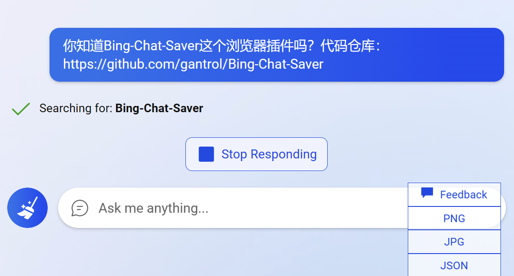
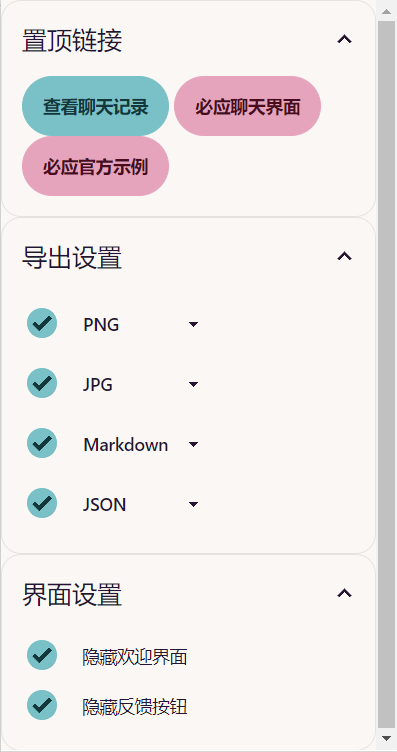
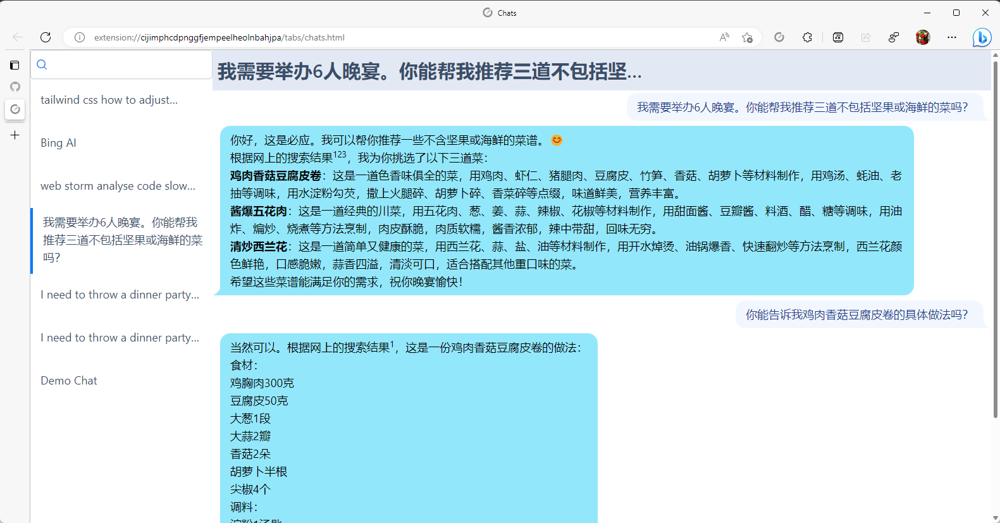

# 必应聊天分享与保存

[](https://chrome.google.com/webstore/detail/bing-chat-saver/ficbllnhlgldegblbimkeldcdhfjppkg?hl=zh-CN)


## 功能

这个插件添加可以将聊天记录导出，同时保存相关数据到本地存储，方便稍后查阅，目前支持的格式为：

- PNG
- JPG
- JSON
- Markdown

它能让你在Chrome上使用必应聊天。

同时，可以隐藏欢迎界面或反馈按钮。

## 下载

- [Chrome Store](https://chrome.google.com/webstore/detail/bing-chat-saver/ficbllnhlgldegblbimkeldcdhfjppkg?hl=en)获取稳定版本（更新有延迟，一般是两天）
- 去[releases页面](https://github.com/gantrol/Bing-Chat-Saver/releases/), 下载 `.zip`并到 `edge://extensions/`加载插件。正如下文结果示意图必应所说，你可就着浏览器翻译功能，参考[这篇文章](https://www.howtogeek.com/510543/how-to-install-and-use-extensions-in-the-new-microsoft-edge/)
- Edge商城的下载正待审核……

## 用法

### 新按钮

安装插件后，在与必应聊天的界面（非搜索侧边栏），右下角原先只有反馈按钮，会增加相应导出按钮。如预览会打开一个新的PNG网页，导出会按格式设置导出（具体可单击插件图标，查看popup设置）。



现阶段结果示例（可导出长图）：


### 选项

popup有更多选项，如导出为Markdown、隐藏欢迎界面等：



### 历史

点击 Popup 的 `查看聊天记录`按钮后:



### Demo results


## 接下来的主要待办

1. 通过导入 JSON，“重新加载”对话
2. 自动缓存历史对话列表

其他详见[项目看板](https://github.com/users/gantrol/projects/5)

## 开发

> 以下是`Plasmo`库的文档（Svelte版本）。其他开发信息见[手册](./docs/manual.md)

这是一个以 [Plasmo 插件开发框架](https://docs.plasmo.com/) 为基础的插件应用（改代码不用手工reload）

### 起步

> 确保在你的Svelte组件中把type="ts"替换成lang="ts"

克隆项目

```bash
git clone https://github.com/gantrol/Bing-Chat-Saver.git
cd Bing-Chat-Saver/
```

安装依赖

```bash
pnpm i
# or
npm run i
```

运行:

```bash
pnpm dev
# or
npm run dev
```

打开浏览器，加载适当的dev build（目前配置里只有chrome的build，毕竟新必应在其他浏览器也用不了）。 例如，如果你在使用manifest v3为chrome浏览器开发插件，请使用。`build/chrome-mv3-dev`。

你可以通过修改`popup.svelte`来编辑弹出窗口。它应该在你做修改时自动更新。

> 注：有时连接会失败，还是要手动重新加载

要添加一个选项页，只需在项目的根部添加一个`options.svelte`文件，并默认导出一个react组件。同样，要添加`context`，在项目的根部添加一个`content.ts`文件，编写完毕后，在浏览器上重新加载扩展。

如需更多指引，[可访问plasmo的官方文档](https://docs.plasmo.com/)

### 构建生成包

执行：

```bash
pnpm build
# or
npm run build
```

This should create a production bundle for your extension, ready to be zipped and published to the stores.

### 提交到插件商城

The easiest way to deploy your Plasmo extension is to use the built-in [bpp](https://bpp.browser.market) GitHub action. Prior to using this action however, make sure to build your extension and upload the first version to the store to establish the basic credentials. Then, simply follow [this setup instruction](https://docs.plasmo.com/framework/workflows/submit) and you should be on your way for automated submission!
